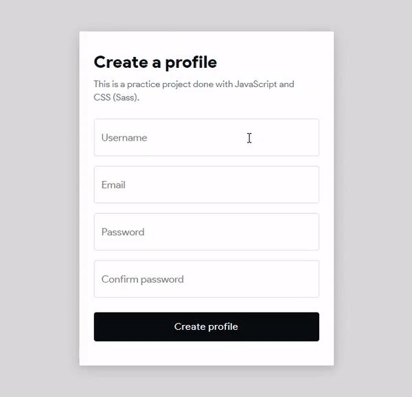
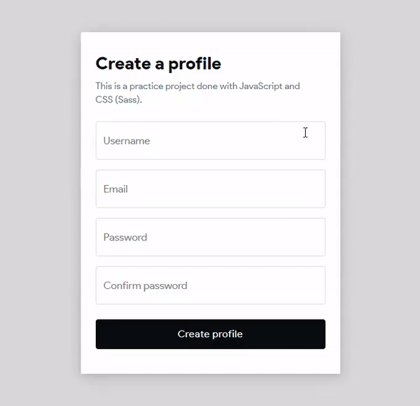
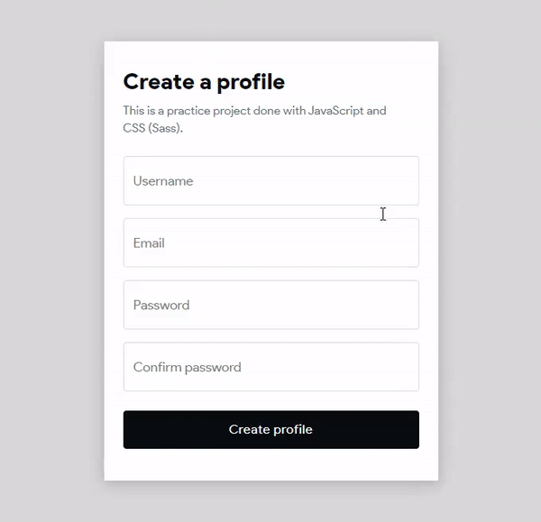

# form-validation

This is a practice project done with JavaScript and CSS (Sass). Form control validations are in place along side subtle animations to indicate states.

Preview gifs are rendered at 1.5x playback speed.
